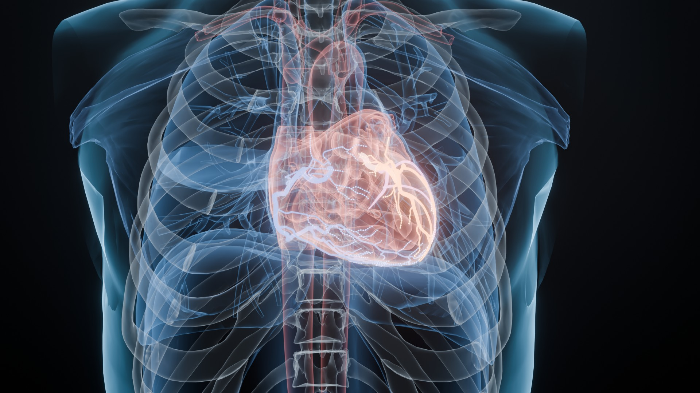
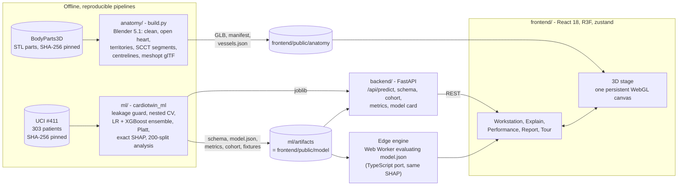

# CardioTwin

**An explainable 3D coronary-risk digital twin.** From 53 routine clinical variables it estimates overall coronary
artery disease (CAD) and stenosis of each major artery (LAD, LCX, RCA). Every estimate is explained with exact SHAP
values and painted onto an interactive 3D heart built from open BodyParts3D anatomy. It all runs in the browser.

[](https://github.com/Mohammad-Umar7/CardioTwin/actions/workflows/ci.yml)


Before an invasive angiogram, a clinician has a patient's history, examination, ECG, labs and echo, but no view of
*which* artery is likely to be narrowed or *why*. CardioTwin gives one: a calibrated probability for CAD and for each
vessel, an exact per-feature explanation of each one, and a 3D heart whose arteries glow in the colour of their risk.
The models were trained on the public UCI *Extension of Z-Alizadeh Sani* cohort and validated with a locked test set,
nested cross-validation and 200 random re-splits. Every metric below is reported with its uncertainty. The same
model runs on a FastAPI server and, bit for bit, inside the browser, so the demo works with no backend at all.

> **Clinical safety.** CardioTwin is a research and educational decision-support prototype. Its outputs are **not a
> diagnosis** and are **not a substitute** for coronary angiography, CT coronary angiography or any formal diagnostic
> imaging. Risk is estimated **per vessel**. The model never localises a lesion within a vessel.

<table>
  <tr>
    <td width="50%"></td>
    <td width="50%"></td>
  </tr>
  <tr>
    <td>Coronary tree coloured by vessel risk (example profile)</td>
    <td>Perfusion territories (AHA-17 blend), tinted by vessel risk</td>
  </tr>
  <tr>
    <td></td>
    <td></td>
  </tr>
  <tr>
    <td>Exploded thorax, as in the viewer's dissection</td>
    <td>X-ray look with blood-flow particles along the centrelines</td>
  </tr>
</table>

Cycles renders of the published asset. A 7-second turntable is at
[`docs/media/renders/heart_turntable.mp4`](docs/media/renders/heart_turntable.mp4).

<!-- SCREENSHOT: landing → docs/media/screenshots/landing.png (1440×900, landing hero with the KPI strip) -->
<!-- SCREENSHOT: workstation → docs/media/screenshots/workstation.png (1440×900, test patient, risk summary card, vessels coloured) -->
<!-- SCREENSHOT: workstation-lad → docs/media/screenshots/workstation-lad.png (LAD selected: camera at its best view, vessel inspector open) -->
<!-- SCREENSHOT: dissection → docs/media/screenshots/dissection.png (peel slider at the open heart) -->
<!-- SCREENSHOT: explain-why → docs/media/screenshots/explain-why.png (Explain drawer, Why tab: SHAP waterfall and modality strip) -->
<!-- SCREENSHOT: whatif → docs/media/screenshots/whatif.png (Edit inputs drawer with two edits, what-if pill, recorded vs what-if) -->
<!-- SCREENSHOT: performance → docs/media/screenshots/performance.png (performance page: summary tiles, CIs, robustness) -->
<!-- SCREENSHOT: report → docs/media/screenshots/report.png (printable two-page clinical report) -->

**Documentation:** [technical report (6 pages, PDF)](docs/TECHNICAL_REPORT.pdf) ·
[architecture](docs/ARCHITECTURE.md) · [model card](docs/MODEL_CARD.md) · [full results](ml/reports/results.md) ·
[interface contracts](docs/CONTRACTS.md) · [anatomy pipeline](anatomy/README.md) ·
[anatomical reference](docs/anatomy/REFERENCE.md) · [demo script](docs/DEMO_SCRIPT.md)

---

## Why

* **Where is the disease, not just whether.** Pre-test risk scores give one number for the whole heart. A clinician
  reading an echo, an ECG and a lipid panel wants to know which territory is at stake, and which findings drive it.
* **A black box is not usable at the bedside.** A probability without its reasons cannot be checked against the
  clinician's own reading of the case. CardioTwin shows every input's signed contribution, in percentage points
  that add up exactly from a typical patient's risk to this patient's.
* **Referred patients are not all diseased.** In the source cohort, all 303 patients were already referred for
  invasive angiography, yet 87 (29 %) had no ≥ 50 % stenosis ([`data/README.md`](data/README.md)).

## What it does

| Track A requirement | How CardioTwin meets it | Where |
| --- | --- | --- |
| Predict CAD and LAD / LCX / RCA stenosis | Four calibrated classifiers (logistic regression + XGBoost margin ensemble, Platt scaling, Youden threshold) | [`ml/`](ml/README.md), [`ml/configs/targets.yaml`](ml/configs/targets.yaml) |
| Exclude LAD, LCX, RCA, Cath from the inputs | Enforced four times: training leakage guard, unit test, API 422 `leakage_feature`, browser input sanitiser | `ml/src/cardiotwin_ml/preprocess.py`, `ml/tests/test_leakage.py`, `backend/app/validation.py`, `frontend/src/services/engine.ts` |
| Accuracy, precision, recall, F1, ROC-AUC | On a locked 61-patient test set with 95 % bootstrap CIs, plus PR-AUC, MCC, Brier, calibration and decision curves | [`ml/reports/results.md`](ml/reports/results.md), `/performance` page |
| Interactive 3D torso and heart | 41 anatomical structures in 7 layers (≈ 400k triangles), with rotate, zoom, pan, C-arm presets and click or keyboard selection | [`anatomy/`](anatomy/README.md), `frontend/src/three/` |
| Vessels colour-coded by stenosis probability | Each artery's mesh is driven by its own target's probability on one perceptual ramp shared by the 3D view, the charts and the legend | `frontend/src/theme/risk.ts`, `frontend/src/three/anatomy/useRiskAnimation.ts` |
| Clinical dashboard: CAD status and vessel probabilities | Risk summary card (CAD verdict, flagged vessels) and vessel inspector (probability, band, threshold, territory) | `frontend/src/features/risk/` |
| SHAP/LIME breakdown | Exact SHAP: linear SHAP plus float64 TreeSHAP, additive to ≤ 1.8e-15, shown as a waterfall in percentage points | `frontend/src/features/explain/`, `ml/src/cardiotwin_ml/explain.py` |
| Physiological measurements with contributions | Physiology tab: each measurement with its value, reference range and signed contribution | `frontend/src/features/explain/PhysiologyTable.tsx` |
| Open-source anatomical meshes | BodyParts3D (CC BY-SA 2.1 JP), every source STL pinned by SHA-256. Missing or collapsed parts (aortic root and valve, epicardial fat, in-vivo vein calibres) are synthesised deterministically | [`anatomy/SOURCES.md`](anatomy/SOURCES.md) |
| Visible clinical-safety disclaimer | Status line on every page, a Details dialog, every page of the printed report, and the API `/api/health` | `frontend/src/features/shell/DisclaimerBanner.tsx` |
| Responsive without a dedicated GPU | Adaptive render tiers A → C, on-demand frame loop, a 2D SVG fallback (tier D), browser inference p50 1.2 ms | `frontend/src/three/stage/QualityMonitor.tsx`, `frontend/src/inference/` |
| Consistent model output ↔ vessel mapping | One registry maps each target to its glTF nodes, and the end-to-end check verifies that the served schema matches the anatomy manifest | `ml/configs/targets.yaml`, `frontend/public/anatomy/manifest.json`, `scripts/e2e_check.py` |
| Extensible architecture | YAML and JSON registries for features, targets, models and anatomical structures, plus versioned contracts | [Extending](#extending) |

Beyond the brief:

* **What-if analysis.** Edit any input and all four estimates, the explanations and the 3D colours update live.
* **ICE strips** on the numeric inputs show how the risk would change across each input's range.
* **Ground-truth reveal.** For the 61 test patients, the prediction can be compared with the angiogram result.
* **Guided tour** of five chapters, a command palette (`Ctrl K`) and full keyboard control.
* **Printable report.** A two-page clinical report prints on A4 or Letter.
* **Engine cross-check.** A server ⇄ browser check runs live in the background (EngineBadge).

## Results

**Locked test set** (61 patients never seen in development, scored once per release). Values are point estimates
with 95 % stratified-bootstrap CIs (2000 resamples) at the deployed Youden threshold. The development CV is repeated
stratified 5-fold × 10, with nested tuning and cross-fitted ensemble choices (mean ± sd).

| Target | ROC-AUC | Accuracy | Precision | Recall | F1 | Dev-CV ROC-AUC |
| --- | --- | --- | --- | --- | --- | --- |
| **CAD** | **0.858** (0.743–0.955) | 0.820 (0.721–0.918) | 0.902 (0.829–0.975) | 0.841 (0.727–0.932) | **0.871** (0.791–0.940) | 0.937 ± 0.034 |
| LAD | 0.742 (0.612–0.858) | 0.639 (0.525–0.754) | 0.694 (0.594–0.808) | 0.694 (0.556–0.833) | 0.694 (0.580–0.800) | 0.867 ± 0.057 |
| LCX | 0.814 (0.701–0.907) | 0.721 (0.607–0.820) | 0.618 (0.513–0.735) | 0.840 (0.680–0.960) | 0.712 (0.600–0.808) | 0.738 ± 0.053 |
| RCA | 0.759 (0.627–0.866) | 0.623 (0.508–0.738) | 0.500 (0.405–0.606) | 0.783 (0.609–0.913) | 0.610 (0.491–0.714) | 0.727 ± 0.071 |

**The locked split turned out to be a hard one.** The full recipe (hyper-parameter search, out-of-fold
weight / Platt / threshold, refit) was re-run on **200 random stratified 80/20 splits**. The median held-out ROC-AUC
was **CAD 0.934** (5th–95th percentile 0.864–0.975), **LAD 0.844** (0.771–0.909), LCX 0.762 (0.672–0.833) and
RCA 0.751 (0.660–0.828). The locked split ranks at the **3rd percentile for CAD** and the 2nd for LAD, while the
cross-fitted CV means sit mid-distribution. The CV-to-test gap therefore reflects split difficulty, not
overfitting: the clinical baseline drops on that split too. The harness reproduces the deployed model on the locked
split exactly (max |Δp| = 0).

**Multimodality pays off where it should.** Adding ECG, labs and echo to bedside information raised development-CV
ROC-AUC by **+0.069 (95 % CI +0.024 to +0.115) for LAD** and +0.028 (+0.002 to +0.054) for CAD. For LCX and RCA the
gains (+0.028 and +0.021) have CIs that include 0. Echocardiography carries the unique information, and symptoms
(typical angina) remain the strongest single modality.

**Honest limits.** On the locked test set the full model does **not** significantly beat a 5-feature clinical
baseline for any target (every paired ΔAUC CI includes 0). Across the 200 splits it wins in 84 % (CAD) and 92 % (LAD)
of splits. Calibration-in-the-large is within ±0.02 for every target, but the CAD and LAD calibration slopes on the
locked split (0.62 and 0.47) are over-confident. Full tables, calibration, subgroups and the release history are in
the [model card](docs/MODEL_CARD.md) and [`ml/reports/results.md`](ml/reports/results.md).

<p align="center"></p>

## Architecture



The server and the browser evaluate the same portable model. They agree to |Δp| ≤ 2.2e-16 with identical SHAP on
all 81 demo patients, and CI checks this on every push. If the API is unreachable the app falls back to the
in-browser engine, which is how the static GitHub Pages build works. Details:
[`docs/ARCHITECTURE.md`](docs/ARCHITECTURE.md).

## Quick start

**Prerequisites**

| Tool | Version | Needed for |
| --- | --- | --- |
| Python | 3.11 (the published artifacts and pins were produced with 3.11) | ML pipeline, API, tests |
| Node.js | 22 (≥ 20.19) with npm 10 | Web app, anatomy QA tooling |
| Blender | 5.1, optional | Rebuilding the 3D anatomy only |
| Docker | optional | Containerised run |

No GPU is required. The committed artifacts (`ml/artifacts/`, `frontend/public/anatomy/`) let you run the app
without training anything.

**One command**

```powershell
# Windows (PowerShell 5.1 or 7)
.\scripts\dev.ps1 setup      # .venv (Python 3.11) with pinned deps + npm ci
.\scripts\dev.ps1 dev        # API on :8000 + Vite on :5173 (hot reload)  ->  http://localhost:5173
.\scripts\dev.ps1 serve      # ONE process, ONE URL: built app + API    ->  http://localhost:8000
```

```bash
# Linux, macOS, Git Bash
make setup
make dev                     # -> http://localhost:5173
make serve                   # -> http://localhost:8000   (app at /, API at /api, OpenAPI at /docs)
```

If PowerShell blocks the script, run `powershell -ExecutionPolicy Bypass -File scripts\dev.ps1 <target>`. Every
runner checks its ports first. Use `-BackendPort / -FrontendPort / -Port` (or `BACKEND_PORT=… FRONTEND_PORT=… PORT=…`
with make) to move them. `make smoke` starts everything, verifies it end to end and stops.

**Docker**

```bash
docker compose up --build    # -> http://localhost:8000  (non-root, read-only filesystem, health check)
```

**Static, no server:** `make build`, then serve `frontend/dist/` from any static host. The in-browser engine takes
over. The manual `Pages` workflow deploys exactly this.

## Manual setup

```bash
# 1. Python environment (on Windows use .venv/Scripts/python)
python3.11 -m venv .venv
.venv/bin/python -m pip install -r scripts/requirements-dev.txt          # pinned ML + API + test + lint stack
.venv/bin/python -m pip install -e ml -c scripts/constraints.txt         # the cardiotwin_ml package

# 2. Web app dependencies
npm ci --prefix frontend
npm ci --prefix anatomy                                                  # only for the anatomy QA tests

# 3. Run the API (loads ml/artifacts once at startup)
.venv/bin/python -m uvicorn app.main:app --app-dir backend --port 8000

# 4. In a second terminal: the web app with hot reload (proxies /api to :8000)
npm --prefix frontend run dev                                            # -> http://localhost:5173

# or: single URL - build the SPA once and let the API serve it
npm --prefix frontend run build
.venv/bin/python -m uvicorn app.main:app --app-dir backend --port 8000  # -> http://localhost:8000
```

Useful switches: `?engine=edge` or `?engine=server` in the app URL forces an engine. `CARDIOTWIN_PREDICTOR=fake` runs
the API without trained artifacts, for UI work. All API settings are listed in
[`backend/README.md`](backend/README.md#configuration).

## Reproduce the models

```bash
.venv/bin/python -m cardiotwin_ml.data             # re-download the UCI spreadsheet and verify its SHA-256 (optional; committed)
.venv/bin/python -m cardiotwin_ml.train            # full deterministic run -> ml/artifacts, docs/figures, ml/reports/results.md (~4 min, 12 workers)
.venv/bin/python -m cardiotwin_ml.analysis --jobs 8  # robustness (200 splits), modality ablation, subgroups (~40 min)
.venv/bin/python -m cardiotwin_ml.report           # regenerate figures and the report without retraining
```

`--fast` gives a reduced smoke run, and `--dev-only` never touches the test set. Reruns reproduce every JSON
artifact byte for byte, and CI trains twice from the raw data and compares the results. Protocol details:
[`ml/README.md`](ml/README.md).

## Rebuild the anatomy

```bash
.venv/bin/python anatomy/build.py                  # fetch -> Blender -> centrelines -> optimise -> verify -> manifest -> explode check
.venv/bin/python anatomy/build.py --renders        # ... plus the Cycles renders in docs/media/renders
.venv/bin/python anatomy/checks/measure_model.py   # grade the published GLB against the cited anatomical reference (70 checks)
```

This needs Blender 5.1 (`--blender PATH` or `CARDIOTWIN_BLENDER`), Node, and internet for the first fetch
(~190 MB of STL, cached). The whole pipeline is driven by [`anatomy/config/anatomy.json`](anatomy/config/anatomy.json).

## Testing

| Command | Covers |
| --- | --- |
| `make test` / `.\scripts\dev.ps1 test` | Everything below, plus the frontend typecheck and lint |
| `.venv/bin/python -m pytest ml/tests` | Leakage guard, encoding, calibration, TreeSHAP, portable parity, bit-exact artifacts |
| `.venv/bin/python -m pytest backend` | API unit, contract and real-model integration tests (SHAP additivity, fixtures) |
| `.venv/bin/python -m pytest anatomy` | Asset contracts, centreline graphs, mesh QA (no Blender needed) |
| `npm --prefix frontend test` | Vitest: components, engine parity with `fixtures.json`, split-routing oracle, colour-vision gate |
| `python scripts/e2e_check.py --url http://127.0.0.1:8000` | A running server: health, schema ↔ anatomy, leakage, fixtures, cohort (server = portable = native), batch, SPA, latency |

CI ([`ci.yml`](.github/workflows/ci.yml)) runs all of these on every push. It also runs the ML suite on Windows and
Linux, a reproducibility job, a Docker build with an end-to-end check against the container, and a one-command run
from a clean checkout on both OSes.

## Repository layout

```
ml/          cardiotwin_ml: data, preprocessing, CV, ensemble, SHAP, portable export, analyses, report
  configs/     features.yaml · targets.yaml · training.yaml    (registries: add a feature / target / model here)
  artifacts/   schema, model (portable JSON), metrics, cohort, fixtures, joblib weights
backend/     FastAPI service: validation, LRU cache, contract checks, serves the built SPA
frontend/    React 18 + TypeScript + React Three Fiber web app
  src/inference/  TypeScript port of the portable model (Web Worker, exact TreeSHAP)
  src/three/      3D stage: anatomy, camera rig, labels, FX (heartbeat, flow), adaptive quality
  src/features/   landing, workstation, patient, risk, explain, performance, report, tour, shell
anatomy/     BodyParts3D -> Blender -> glTF pipeline, centrelines, SCCT labels, QA, reference checks
data/        UCI dataset (committed, SHA-256 pinned) + datasheet
docs/        technical report, architecture, contracts, model card, design system, anatomy reference, figures, media
scripts/     one-command runners (dev.ps1, dev.sh), e2e_check.py, pinned constraints
```

## Extending

| To add | Edit | What follows automatically |
| --- | --- | --- |
| A clinical feature | `ml/configs/features.yaml` (column, group, type, unit, range, description) | Encoding, schema, portable model, SHAP rows, API validation, form field, tooltips |
| A target (e.g. left main) | `ml/configs/targets.yaml` (`source_column`, `positive_values`, `anatomy` nodes) | Every training stage, a leakage rule for its column, API and UI ordering, 3D colouring of the listed nodes |
| A model family | `models:` in `ml/configs/training.yaml` or one factory in `models.py` | It joins the nested-CV leaderboard |
| An anatomical structure | `anatomy/config/anatomy.json` (+ `CONTRACTS.md` §6.2 if the viewer must know it) | Fetch, build, optimisation, manifest, focus camera |
| A prediction engine | Implement `PredictionEngine` in `frontend/src/services/engine.ts` | The UI does not know which engine answered |

The contracts in [`docs/CONTRACTS.md`](docs/CONTRACTS.md) are versioned and additive-only.

## Data, anatomy and licences

| Resource | Use | Licence and credit |
| --- | --- | --- |
| **Extension of Z-Alizadeh Sani dataset**, UCI ML Repository #411 | Training and evaluation (`data/raw/`) | CC BY 4.0. Alizadehsani R., Roshanzamir M., Sani Z. (2013), [doi:10.24432/C5461K](https://doi.org/10.24432/C5461K) |
| **BodyParts3D**, Database Center for Life Science (Japan) | Meshes processed into `frontend/public/anatomy/` | CC BY-SA 2.1 JP. "BodyParts3D, © The Database Center for Life Science licensed under CC Attribution-Share Alike 2.1 Japan". The derived meshes are redistributed under the same licence. |
| **SCCT 2014** segment model, **AHA 17-segment** model | Coronary segment labels and territory blend | Cited in [`docs/anatomy/REFERENCE.md`](docs/anatomy/REFERENCE.md) |

**Code:** MIT, © 2026 Mohammad Umar (see [`LICENSE`](LICENSE) and [`NOTICE.md`](NOTICE.md)).

> **Clinical safety.** Research and educational decision support only. Not a medical device, not a diagnosis, and not
> a substitute for angiography, CT coronary angiography, functional testing or clinical judgement. The model was
> developed on one referred, single-centre cohort (71 % CAD prevalence). External validation and local recalibration
> are required before any other use.
