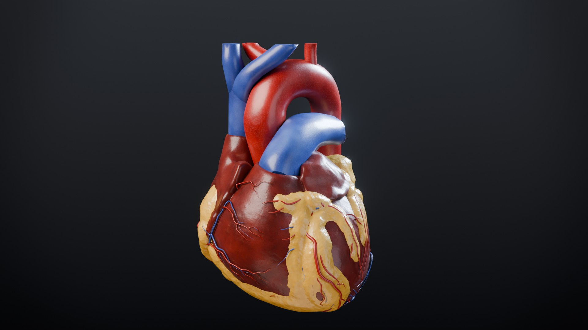

# CardioTwin anatomy pipeline

Reproducible, scripted pipeline that turns **BodyParts3D** anatomical meshes into the web assets behind
CardioTwin's 3D viewer:

| Output | What it is |
| --- | --- |
| `frontend/public/anatomy/cardiotwin_anatomy.glb` | 41 named anatomical nodes under 7 `Layer_*` groups (CONTRACTS §6.2 + v1.1 additive nodes), 399,683 triangles, baked PBR textures (WebP), **8.3 MB** (meshopt) |
| `frontend/public/anatomy/manifest.json` | Layers, structures (with FMA id, definition, clinical relevance, provenance), SCCT segment table, vein table, attribute docs, model-target mapping, explode vectors, camera presets (§6.3, §7.1) |
| `frontend/public/anatomy/vessels.json` | Coronary centrelines, proximal → distal, with lumen radius and SCCT labels; labelled cardiac-vein centrelines (§6.4, §7.1) |
| `docs/media/renders/*.jpg`, `heart_turntable.mp4` | Cycles portfolio renders and an EEVEE preview of the published GLB (`web_preview.jpg`) |

What is BodyParts3D, what is derived and what is synthesised (aortic root and valve, epicardial fat, in-vivo cardiac
veins) is listed in [`docs/anatomy/SYNTHESIS.md`](../docs/anatomy/SYNTHESIS.md); the anatomical reference and its checks
are [`docs/anatomy/REFERENCE.md`](../docs/anatomy/REFERENCE.md) and [`checks/`](checks/) (`gap_report.md`).



## Quick start

```bash
./.venv/Scripts/python anatomy/build.py             # fetch → synth → blender → centrelines → bake → optimise → verify → manifest → explode (~5 min)
./.venv/Scripts/python anatomy/build.py --renders   # … plus the Cycles renders (GPU recommended)
./.venv/Scripts/python -m pytest anatomy            # geometry utilities, centreline graphs, asset contracts, mesh QA
./.venv/Scripts/python anatomy/checks/measure_model.py --markdown gap.md --json gap.json   # 70 reference checks (~4 min)
```

Prerequisites

* Python 3.11 virtualenv at `./.venv` with `numpy scipy trimesh scikit-image networkx rtree matplotlib pytest`
  (all in the project requirements).
* **Blender 5.1** (headless). Default path `C:/Program Files/Blender Foundation/Blender 5.1/blender.exe`; override with
  `--blender PATH` or `CARDIOTWIN_BLENDER`.
* **Node 18+**. `build.py` runs `npm ci` in `anatomy/` on first use (`@gltf-transform/*`, `meshoptimizer`, `sharp` for WebP).
* Internet access for the first fetch (~190 MB of STL, cached in `anatomy/raw/`, git-ignored).

Everything is driven by two declarative files, **`anatomy/config/anatomy.json`** (parts, layers, budgets, crops,
collision rules, territory parameters) and **`anatomy/config/definitions.json`** (FMA ids, precise definitions,
clinical relevance, vein table). Geometry, centrelines and the manifest rebuild deterministically; the baked textures
are Cycles bakes with a fixed seed (GPU noise can change individual texels, not the look). `anatomy/SOURCES.md` pins
every input STL by SHA-256 and lists the derived / synthesised parts.

## Stages

| # | Stage | Command (from repo root) | Output |
| --- | --- | --- | --- |
| 1 | Fetch | `./.venv/Scripts/python anatomy/scripts/fetch_bodyparts3d.py` | `anatomy/raw/*.stl`, `anatomy/SOURCES.md` |
| 1b | Synthesis | `./.venv/Scripts/python anatomy/scripts/synthesize.py` | `anatomy/build/synth/SYN_*.ply`, `vein_centerlines.json`, `synth_report.json` |
| 2–4 | Blender build | `blender --background --factory-startup --python anatomy/blender/build_anatomy.py` | `anatomy/build/cardiotwin_anatomy.raw.glb`, `build_report.json`, `vessels/*.ply`, `cardiotwin_build.blend` |
| 4a | Texture bake | `blender --background --factory-startup --python anatomy/blender/bake_textures.py` | `anatomy/build/bake/<node>_{base,normal,orm}.png`, `bake_manifest.json` |
| 4b | Web optimisation (after stage 5: needs `vessels.json` for `_ARCLEN` / `_SEGMENT` / `_VEIN`) | `node anatomy/scripts/optimize_glb.mjs` | `frontend/public/anatomy/cardiotwin_anatomy.glb` |
| 4c | Contract check | `./.venv/Scripts/python anatomy/scripts/verify_glb.py` | pass/fail + per-node report |
| 5 | Centrelines | `./.venv/Scripts/python anatomy/scripts/extract_centerlines.py` | `vessels.json`, `anatomy/build/centerline_report.json` |
| 6 | Manifest | `./.venv/Scripts/python anatomy/scripts/make_manifest.py` | `manifest.json` |
| 6b | Explode check | `blender --background --factory-startup --python anatomy/blender/check_explode.py` | pass/fail + `anatomy/build/explode_report.json` |
| 7 | Renders | `blender --background --factory-startup --python anatomy/blender/render_heroes.py -- [--shots …] [--save-scene]` | `docs/media/renders/` |
| 7b | Web preview | `blender --background --factory-startup --python anatomy/blender/render_web_preview.py` | `docs/media/renders/web_preview.jpg` |
| QA | Decode for QA | `node anatomy/scripts/decode_glb.mjs [glb] OUT_DIR` | plain per-node arrays (used by `tests/test_mesh_quality.py`) |
| QA | three.js view | `node anatomy/scripts/check_three.mjs` | attributes as three.js names them (`_segment`, `_vein`, `_dist_hilum` …) and the baked maps on the heart-wall material |
| QA | Previews | `blender --background --factory-startup --python anatomy/blender/preview.py -- --views torso,heart,open,territory,qa` | `anatomy/build/preview/*.png` |

`build.py --only manifest,verify` runs a subset; `--skip fetch` skips stages.

## Sources and licence

All source meshes come from **BodyParts3D** (Database Center for Life Science, Japan) via the GitHub mirror
`Kevin-Mattheus-Moerman/BodyParts3D`; every part name was checked against `parts_list_e.txt`
(see [`SOURCES.md`](SOURCES.md) for ID, name, node, triangle count, bytes and SHA-256 of all 112 parts). The aortic root
and valve and the epicardial fat are synthesised, the cardiac veins and the ascending aorta derived from BodyParts3D
(see [`docs/anatomy/SYNTHESIS.md`](../docs/anatomy/SYNTHESIS.md)).

> BodyParts3D, © The Database Center for Life Science, licensed under CC BY-SA 2.1 Japan.

The derived meshes (`cardiotwin_anatomy.glb`, `vessels.json` geometry) are a modified work and are redistributed
under **CC BY-SA 2.1 JP**. The pipeline code in `anatomy/` is **MIT** (repository `LICENSE`).

## Coordinate frame

BodyParts3D uses millimetres with **+X patient-left, +Y posterior, +Z superior** (`coordinate_system.png`),
verified anatomically on the data: the spine (y ≈ 0 mm) lies posterior to the sternum (y ≈ −200 mm), and the distal
LAD / cardiac apex sits at +x, −y, low z (left-anterior-inferior). That is exactly Blender's frame for the contract,
so the only transform is

```
p_scene = (p_mm − origin_mm) × 0.01        origin_mm = heart-wall bbox centre = (21.42, −121.85, 1237.01)
```

and Blender's glTF exporter maps Blender +Z → glTF **+Y (superior)** and Blender −Y → glTF **+Z (anterior)**, giving
the contract frame (1 unit = 10 cm, +X patient-left, radiological display). Every mesh node's origin is its
bounding-box centre and nodes carry **translation only** (no rotation/scale), parented to `Layer_*` empties at the
origin — the viewer can offset or scale any node safely.

## Mesh processing

* **Cleanup per part** — STL import (`bpy.ops.wm.stl_import`), then connected components with negative signed volume
  (inward-facing internal pockets; e.g. ~2 000 fragments inside the heart wall) or fewer than 5 % of the part's
  largest component are deleted; vertices are welded (1 µm), degenerate faces dissolved, normals made consistent
  and outward.
* **Skin** — the whole-body `FMA7163` has many internal surfaces; the true epidermis is a separate shell, identified
  by casting 840 horizontal rays from outside the body (100 % hit it first). It is cropped to z ∈ [980, 1397] mm
  (clavicles to below the costal margin) and the upper limbs are removed with an oblique shoulder plane through the
  axilla (159, 1140) and lateral shoulder (190, 1350) mm, applied only above the axilla — below it the arms are
  separate tubes and are dropped by connectivity. The pectoral tendons are trimmed at the same plane.
* **Thorax limits** — aorta, IVC and trachea are cut (and capped) to z ∈ [986, 1390] mm so nothing leaves the torso.
* **Seamless aorta** — BodyParts3D splits the aorta into ascending / arch / descending pieces whose end caps show
  as seam rings; they are fused by a 0.6 mm voxel remesh and relaxed with a corrective smooth.
* **Terrace removal** — BodyParts3D surfaces carry ~1 mm segmentation terraces that read as wood grain under
  specular light. The heart wall gets a Taubin λ|μ low-pass (10 iterations on the welded source, 5 more after
  decimation; mean surface shift 0.3 mm, coronary centrelines stay within 0.1 mm of the epicardium) and the
  pectorals 10 iterations before decimation (`"taubin": {"pre", "post"}` per node in the config). The build
  fails if a heart half cannot be capped (a sign of over-smoothed thin wall touching itself on the cut plane).
* **Decimation** — quadric collapse to the per-node budget, then smooth shading with corner-angle-weighted normals;
  edges folding more than 75° (thin-wall rims at vessel and valve openings, cap edges) are split sharp so two
  opposite surfaces are never averaged into a dark seam. (Face-area weighting was dropped: on the decimated wall it
  inverted ~4 % of vertex normals against their faces.) Coronary arteries are never decimated (they keep 100 % of
  the source detail).
* **Costal cartilages** — the individual cartilages of ribs 1–7 (FMA) plus the fused ribs 8–10 costal-margin sets
  (`BP24`/`BP28`); the two sets do not overlap (only the rib-7 joint touches).
* **Synthesised and derived parts** — `SYN_*` parts from `scripts/synthesize.py` (cardiac-vein tree, rounded ascending
  aorta, aortic root with sinuses, aortic valve) are read from `build/synth/` like source parts; the cardiac veins are
  voxel-remeshed at 0.25 mm into one lumen.
* **Epicardial fat** — built on the decimated heart wall before it is opened: a shell whose thickness follows the AV and
  interventricular grooves with a channel for every coronary artery and vein, lobulated, voxel-remeshed, then split
  with the same plane as the wall (`EpicardialFat_Anterior` / `_Posterior`).
* **Collisions** — display-only neighbours yield to the structures they intersect (`collisions` in the config): a
  two-sided test (neighbour vertices inside a master, and master vertices inside a coarse neighbour) moves the
  neighbour along the surface normal and spreads the dent smoothly; the diaphragm is lowered 4 mm as a whole.
* **Pulmonary distances** — `_DIST_HEART` (geodesic distance from the pulmonary valve / left-atrial ostia) and
  `_DIST_HILUM` (signed geodesic distance from the lung entry, > 0 inside the lungs) on both pulmonary trees.
* **UVs** — Smart UV projection (66°) on every non-coronary node for the baked textures.

### Triangle budget (total 399,683 ≤ 400,000)

| Node | Layer | Source parts | Source tris | Final tris |
| --- | --- | --- | ---: | ---: |
| `Skin_Torso` | skin | FMA7163 (outer shell, cropped) | 23,002 | 18,500 |
| `Pectoralis_L` / `_R` | muscle | sternocostal + clavicular parts | 41,986 / 41,758 | 6,000 / 6,000 |
| `Ribs_L` / `Ribs_R` | skeleton | 12 ribs each | 381,430 / 374,274 | 19,000 / 19,000 |
| `CostalCartilage` | skeleton | 14 FMA cartilages + BP24/BP28 | 100,898 | 12,000 |
| `Sternum` | skeleton | manubrium, body, xiphoid | 35,884 | 5,000 |
| `Clavicle_L` / `_R` | skeleton | FMA13323 / FMA13322 | 5,140 / 5,112 | 2,998 / 3,000 |
| `Spine_Thoracic` | skeleton | T1–T12 | 97,394 | 21,000 |
| `Lung_L` / `Lung_R` | lungs | 2 / 3 lobes | 84,920 / 119,366 | 16,000 / 18,000 |
| `Trachea_Bronchi` | lungs | trachea + bronchial tree | 125,240 | 8,000 |
| `Oesophagus` | lungs | FMA7131 (thoracic part) | 2,492 | 2,492 |
| `Diaphragm` | diaphragm | FMA13295 (lowered 4 mm) | 210,666 | 8,000 |
| `Heart_Wall_Anterior` / `_Posterior` | heart | FMA7274 (opened) | 306,230 | 54,837 / 55,804 ¹ |
| `Valve_Mitral` / `_Tricuspid` / `_Pulmonary` | heart | FMA7235 / 7234 / 7246 | 19,102 / 47,260 / 18,200 | 5,000 / 5,000 / 3,000 |
| `Valve_Aortic` | heart | synthesised (3 cusps) | 3,744 | 3,000 |
| `Papillary_Muscles` | heart | 5 parts | 16,404 | 6,000 |
| `GreatVessel_Aorta` | heart | synthesised root, rounded ascending, arch, descending | 32,538 | 12,000 |
| `GreatVessel_Aorta_ArchBranches` | heart | brachiocephalic trunk, R CCA, R subclavian, L CCA, L subclavian | 11,826 | 5,000 |
| `GreatVessel_PulmonaryArtery` / `Veins` | heart | FMA66326 / FMA66643 | 116,948 / 72,548 | 7,000 / 7,000 |
| `GreatVessel_SVC` / `IVC` | heart | FMA4720 / FMA10951 | 1,532 / 5,322 | 1,532 / 3,000 |
| `GreatVessel_SVC_BrachiocephalicVeins` | heart | R / L brachiocephalic, internal jugular and subclavian stumps | 6,412 | 5,000 |
| `CardiacVeins` | heart | re-swept CS, GCV/AIV, MCV, PVLV, ACV (one lumen) | 52,244 | 16,000 |
| `EpicardialFat_Anterior` / `_Posterior` | heart | synthesised groove fat (opened) | 375,768 | 7,720 / 7,424 |
| `Coronary_LM` | coronary | FMA4685 | 252 | 252 |
| `Coronary_LAD` / `_LAD_Septal` | coronary | FMA3862nsn / FMA71670 | 9,220 / 1,214 | 9,220 / 1,214 |
| `Coronary_LCX` | coronary | FMA3895 | 3,542 | 3,542 |
| `Coronary_RCA` / `_Marginal` / `_PDA` / `_PL` / `_Septal` | coronary | FMA3802 / 3818 / 3840nsn / 76994 / 71669 | 5,154 / 4,908 / 3,086 / 2,246 / 754 | unchanged |

¹ The wall is decimated as one mesh to 104k triangles; opening it adds the split and cap triangles.

## Opening the heart

The long axis runs from the **apex** — the most left-anterior-inferior heart-wall vertex, 4.5 mm from the distal
LAD — to the **base centre** (centroid of the mitral and tricuspid valves). The heart wall is bisected by the plane
that contains this axis and faces anteriorly (normal = anterior direction orthogonalised against the axis; glTF
`(−0.445, 0.232, 0.865)`), i.e. a long-axis section through both ventricles. Each half is **capped**, so the cut
shows solid myocardium; cap faces are flat with sharp rim edges so smooth shading never bleeds across the cut.
Opening the halves along the cut normal reveals the chambers, valves and papillary muscles.

## Perfusion territories (`COLOR_0` on both heart halves)

`COLOR_0.rgb = (w_LAD, w_LCX, w_RCA)`; `r + g + b` is the territory confidence and `1 − (r + g + b)` is neutral.

1. For every wall vertex, the distance `d_k` to the nearest point of each coronary group — LAD (+ septal
   perforators), LCX, RCA (+ acute marginal, PDA, posterolateral, septal) — gives `w_k = softmax(−d_k / σ)`,
   σ = 7 mm, faded as `exp(−max(0, min d − 20 mm) / 15 mm)` far from every artery.
2. **Ventricular mask** — weights fade to zero outside ventricular myocardium, defined as wall that is
   *thick* (≥ 4.5–6.5 mm; wall thickness = shortest of 7 inward rays through the solid wall, so vessel rims do not
   read as thick) **or** closer to ventricular landmarks (papillary muscles, septal perforators, PDA, marginal /
   posterolateral branches, apex — ignoring points within 12 mm of the AV-groove vessels) than to the inflow /
   outflow landmarks (venae cavae, pulmonary veins, aortic and pulmonary roots). Wall within 6–14 mm of the
   pulmonary trunk (artery within 50 mm of the pulmonary valve) is never ventricular: BodyParts3D's left atrial
   appendage is solid, passes the thickness rule and wraps around the trunk, and without this gate it glowed in the
   LAD's colour in the default anterior view. Atria, auricles and great-vessel roots therefore stay neutral.
3. Laplacian smoothing (6 iterations) removes decimation-scale seams. Cap vertices get transmural weights.

4. **AHA-17 blend** — on LV myocardium the weights are blended 85 % towards the standard AHA-17 territories (the septal
   segments split by whether the LAD or the RCA/PDA septal perforators are nearer), then the three weights are
   re-balanced (iterative proportional fitting, gains capped to 0.8–1.25) towards the population shares of LV mass
   (LAD 42.5 %, LCX 28.8 %, RCA 26.4 %) on the same LV region `anatomy/checks` uses.

This approximates the standard coronary territories of the **AHA 17-segment model** on a **right-dominant** heart:
LAD → anterior wall, anterior septum and apex; LCX → lateral wall; RCA → RV, inferior wall and inferior septum.
**Limitations**: it is a nearest-artery supply map, not perfusion imaging and **not a lesion map** (the ML model
predicts vessel-level stenosis, never a location within a vessel); dominance and collaterals vary between
patients; the posterior lobe of the left atrial appendage keeps a faint LCX tint (it is in fact supplied by atrial
branches of the LCX, so the colour is not misleading); the left main has no territory of its own (it feeds
LAD + LCX).

## Web optimisation

`optimize_glb.mjs` (glTF-Transform 4 + meshoptimizer + sharp) attaches the baked maps (WebP, `EXT_texture_webp`:
baseColor, normal, and one ORM map used as occlusion R + metallicRoughness G/B; 2048² on the heart walls, 1024² or
512² elsewhere, 2.2 MB in total) to each node's own material, writes `_SEGMENT` / `_VEIN`, reorders vertex caches,
quantises `NORMAL` (10-bit), `TEXCOORD_0` (14-bit) and `COLOR_0` (8-bit RGB; Blender's constant alpha is dropped so
three.js does not enable vertex alpha) and compresses every buffer with `EXT_meshopt_compression`. It deliberately **does not** quantise `POSITION` (KHR_mesh_quantization
would fold dequantisation into node matrices, breaking `node.scale` and explode offsets), join, flatten, instance or
deduplicate materials. It fails if any node name, transform or hierarchy changes, and re-reads its output to check
territory weights and positions. It also writes the coronary `_ARCLEN` attribute (see *Notes for the viewer*), which is why the
centreline stage runs first. The Khronos validator reports no errors or warnings.

## Coronary centrelines (`vessels.json`)

Per coronary node: voxelise the closed mesh at 0.25 mm → 3D skeletonise (scikit-image) → 26-connected graph
(networkx) → minimum spanning tree → prune spurs shorter than 1.6 × the local lumen radius → root at the endpoint
nearest the parent (aortic wall for LM / RCA, LM for LAD / LCX, RCA for marginal / PDA / PL, LAD / PDA for the
septal sets) → split into branch paths (longest first) → cubic smoothing spline with pinned endpoints → uniform
0.8 mm resampling. The lumen radius is the distance from each point to the vessel wall. The first segment of each
vessel starts on its parent (`"attach": "aorta"` or the parent vessel id), so particles flow continuously from
the aortic root into the tree.

Validation (all 9 vessels, 2,612 points): **99.85 % of points inside their vessel mesh, max 0.31 mm outside**
(LCX, at a tight bend; p99 = 0 mm). Lengths: LM 8.6 mm, LAD tree 527 mm (18 segments), LCX 221 mm, RCA trunk
170 mm; median lumen radius LM 1.78 mm, RCA 1.10 mm.

## Manifest

Generated from the config plus measured geometry: per layer `id/node/label/explode/order/nodes`; per structure
`id/node/label/layer/target/explode/description/territory` plus `category`, `material`, `fma`, `center`, `bbox`,
`triangles` (and `territory_weights` / `feeds` where relevant); `targets` maps each model output (`CAD`, `LAD`,
`LCX`, `RCA`) to its nodes; `camera` has `home`, `heart`, `exploded` (frames the layout at t = 1 for a 16:9
canvas) and a `focus` preset per structure (35° vertical FOV).

## Exploded view

Displayed position = rest + t · (layer.explode + structure.explode), t ∈ [0, 1]. The layout is radial in the
picture plane of the home camera, so layers separate on screen instead of stacking along the view axis:

* chest wall — pectorals up and out (±1.55, +0.45), rib halves out (±1.95) beyond the lungs, sternum up (clear of the great vessels) and
  forward, costal cartilages down and forward, clavicles up and out, spine straight back;
* lungs slide out (±0.8) and back to frame the heart; the airway rises;
* heart — the anterior half swings open along the cut normal (0.8) plus a sideways offset (−0.45 X), so the
  home camera sees the epicardium of the anterior half (LAD, RCA) beside the open cavity of the posterior half,
  whose valves, papillary muscles and great vessels stay in place. Coronary branches and cardiac veins ride on the
  half they lie on (the pulmonary valve rides with the anterior half's outflow tract), so vessels stay seated and
  `vessels.json` particles only need their node's offset;
* the skin is an enclosing shell: any translation sweeps it through the organs, so the viewer fades it out.

`blender/check_explode.py` (build stage `explode`) moves every node exactly as documented and tests all pairs for
intersecting triangles: 125 pairs already interpenetrate at rest (coronaries embedded in the epicardium, bronchi in
the lungs) and may keep doing so, but no pair may intersect more at t = 1 than at rest. The previous layout failed
with 9 collisions (lungs through the rib cage, costal cartilages through the LAD and marginal branch, the
pulmonary trees through each other and the SVC); the current one has none. While sliding (0 < t < 1) the
interleaved intrapulmonary vessel and bronchial trees still pass through neighbouring layers — the viewer's
staggered peel windows hide most of that.

## Notes for the viewer

* Load with `GLTFLoader` + `setMeshoptDecoder(MeshoptDecoder)` (three/examples/jsm/libs/meshopt_decoder.module.js).
* Because the heart walls have `COLOR_0`, three.js turns on `vertexColors` for their materials: override the
  material (or read `geometry.attributes.color` in a custom shader) — neutral regions have RGB ≈ 0.
* Every node has its **own** material `<Node>_Mat` (safe to mutate), and glTF `extras` (`userData`):
  `ct_id`, `ct_layer`, `ct_label`, `ct_target` (`"LAD"`, … or `""`), `ct_category` (`Coronary`, `Myocardium`, …).
* Closed meshes are single-sided; only `Skin_Torso` (an open shell) is double-sided.
* `vessels.json` points are in the scene / rest frame — add a vessel node's explode offset when it is displaced.
* **SCCT segments**: coronary meshes carry `_SEGMENT` (three.js: `geometry.attributes._segment`) = SCCT 2014 segment
  of the nearest labelled centreline point (0 = named but unnumbered branch: septal, acute marginal, RV branch, D3);
  `manifest.segments` holds codes, names and definitions, `vessels.json` `segments[].labels` the point ranges.
* **Veins**: `CardiacVeins` carries `_VEIN` (`manifest.veins`: 1 CS, 2 GCV, 3 AIV, 4 MCV, 5 PVLV, 6 ACV);
  `vessels.json` `veins` holds the labelled centrelines (ordered from the drainage end outward).
* **Pulmonary trees**: `_DIST_HEART` / `_DIST_HILUM` (three.js: `_dist_heart` / `_dist_hilum`) let the viewer keep the trunk, main
  branches and venous ostia (`_DIST_HILUM < ~0.02`) and fade the intrapulmonary tree.
* **Baked maps**: every non-coronary material has baseColor / normal / occlusion-roughness WebP maps and neutral
  factors; `COLOR_0` on the heart walls is territory DATA — a spec-compliant viewer would multiply it into the albedo,
  so the Realistic look must not (the web preview doesn't).
* **Additive nodes** (not in CONTRACTS §6.2 v1.0): `Valve_Aortic`, `GreatVessel_Aorta_ArchBranches`,
  `GreatVessel_SVC_BrachiocephalicVeins` (their names already classify as valve / aorta / systemic vein),
  `EpicardialFat_Anterior` / `_Posterior` (ride on their heart half; need a `fat` tissue kind) and `Oesophagus`
  (Layer_Lungs; needs its own kind).
* Coronary meshes carry `_ARCLEN` (float, 0 → 1 along each tree from its ostium: left tree from the left-main
  ostium, right tree from the RCA ostium), taken from the nearest `vessels.json` point. **three.js lower-cases
  custom attribute names**, so read `geometry.attributes._arclen` in a shader.
* DESIGN_SYSTEM §7.8 additive manifest fields: `structures[].rides` (the heart-wall node a coronary branch, the
  cardiac veins or the pulmonary valve moves with; their `explode` equals that wall's), `labelAnchor` /
  `labelNormal` on `Coronary_LAD` / `_LCX` / `_RCA` (a centreline point at 30 / 35 / 25 % of the trunk and the
  outward direction from the heart centre) and `bestView` (LAD RAO 30 / CRA 25, LCX RAO 30 / CAU 25, RCA LAO 40).
  Not provided: layer `pivot` / `hingeAxis` / `hingeDeg` (the peel is translation-only) and a baked-AO `COLOR_1`.

## Renders

`render_heroes.py` (Cycles, OptiX + OpenImageDenoise, AgX) writes `hero_heart.jpg`, `heart_posterior.jpg`,
`coronary_detail.jpg`, `open_heart.jpg`, `exploded_torso.jpg`, `territories.jpg`, `xray.jpg` (1920×1080) and
`heart_turntable.mp4` (1280×720, 7 s), all with the procedural tissue looks of `blender/looks.py` (the same materials
the bake stage turns into the web textures). `render_web_preview.py` imports the **published** GLB (decoded losslessly
by `scripts/decode_for_blender.mjs`) into an empty scene and renders it with EEVEE from the hero camera using only its
baked textures (`web_preview.jpg`), so the web fidelity can be judged against `hero_heart.jpg`. The example risk profile is
LAD critical `#ef4444`, LCX moderate `#f59e0b`, RCA low `#2dd4bf`. Close-ups stage the heart on its own (the
intrapulmonary vein tree and IVC hidden, the pulmonary artery clipped at its bifurcation, the descending aorta cut
behind the atria) using render-only copies — the published asset is never modified. The hero is a left-anterior-oblique
view framing the whole heart and aortic arch (LAD centre-frame, RCA on the right border); the exploded shot is the
head-on view the radial explode layout is designed for, cropped to the thorax, with the skin faded out as in the
viewer. The x-ray shot places emissive flow beads along `vessels.json`. A full set renders in about 2 minutes on
an RTX 4070 laptop GPU (the turntable is 84 s of that).

## Adding a new anatomical structure

1. Find the part(s) in `parts_list_e.txt` and add a node entry to `config/anatomy.json`: `node`, `id`, `layer`,
   `label`, `parts`, `budget`, `material` (a key of `MATERIAL_LOOKS`), `explode`, `target`, `description`
   (optionally `crop`, `remesh_mm`, `coronary_group`, `territory`).
2. `./.venv/Scripts/python anatomy/build.py` — fetch, build, optimisation, manifest and focus camera are automatic.
3. If the node is part of the viewer contract, add it to `docs/CONTRACTS.md` §6.2 and to `CONTRACT_LAYERS` in
   `scripts/verify_glb.py`. A new coronary vessel also needs a line in `TOPOLOGY` in
   `scripts/extract_centerlines.py` (vessel id + parent) and, if it perfuses myocardium, a `coronary_group`.
4. New layers are declared in the config's `layers` list (they become `Layer_*` empties).
