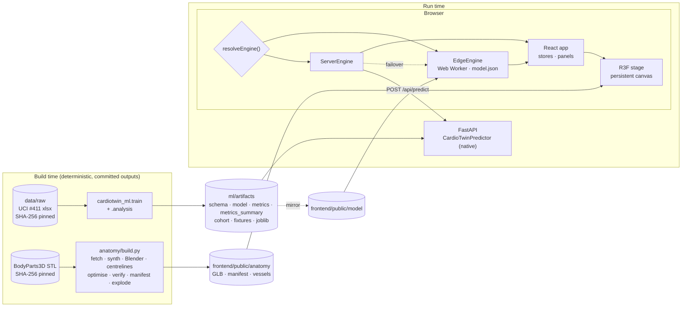
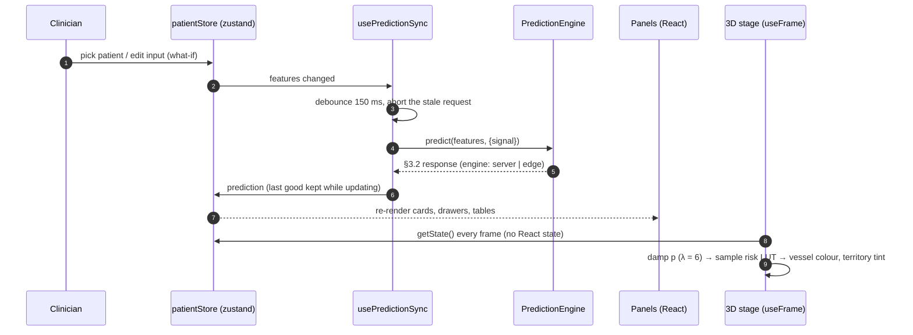
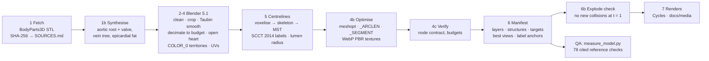

# CardioTwin — system architecture

CardioTwin is built from four subsystems that interact only through versioned file and HTTP contracts
([`CONTRACTS.md`](CONTRACTS.md)). Two offline pipelines produce artifacts. Two runtime components consume them.

| Subsystem | Role | Stack | Entry point | Detailed docs |
| --- | --- | --- | --- | --- |
| `ml/` | Training, validation, explainability, portable export | Python 3.11, scikit-learn 1.9, XGBoost 3.2, pandas, NumPy | `python -m cardiotwin_ml.train` / `.analysis` | [`ml/README.md`](../ml/README.md), [`MODEL_CARD.md`](MODEL_CARD.md) |
| `anatomy/` | BodyParts3D → Blender → glTF, territories, SCCT labels, centrelines, QA | Python, Blender 5.1 (headless), glTF-Transform + meshoptimizer | `python anatomy/build.py` | [`anatomy/README.md`](../anatomy/README.md), [`anatomy/REFERENCE.md`](anatomy/REFERENCE.md) |
| `backend/` | REST API over the native model; optionally serves the built SPA | FastAPI, Pydantic, uvicorn | `uvicorn app.main:app --app-dir backend` | [`backend/README.md`](../backend/README.md) |
| `frontend/` | Clinical workstation, 3D stage, in-browser model | React 18, TypeScript (strict), Vite 6, React Three Fiber 8, three.js 0.172, zustand, d3 | `npm --prefix frontend run dev` | [`frontend/ARCHITECTURE.md`](../frontend/ARCHITECTURE.md), [`design/`](design/) |



## 1. Contracts

Every boundary is a documented, versioned artifact. Producers may **add** fields, but never rename or remove one
without a version bump. The end-to-end check and the test suites enforce the contracts on both sides.

| Contract | Producer → consumers | Key invariants | Enforced by |
| --- | --- | --- | --- |
| Target order and leakage rule (§0) | all | `CAD, LAD, LCX, RCA`. `LAD/LCX/RCA/Cath` are never inputs | `ml/tests/test_leakage.py`, API `leakage_feature` 422, `sanitizeFeatures()`, `e2e_check.py leakage` |
| `schema.json` (§2) | ml → API, UI | 53 features in 7 groups with units, ranges, defaults, reference ranges. Each target lists its glTF nodes | API startup check, `e2e_check.py schema` |
| `POST /api/predict` (§3.2, §7.3) | API / edge → UI | Calibrated `p`, band, label, threshold, SHAP in log-odds with `base + Σφ = logit` (1e-6), plus the calibrated-space `shap_calibrated` that adds up to `σ⁻¹(p)` | Pydantic response models, `test_api_contract.py`, frontend `assertPredictResponse()` |
| `metrics.json`, `metrics_summary.json` (§4, §7.2, §7.4) | ml → API, UI | Test `{value, ci}`, CV `{mean, std}`, curves, leaderboard, robustness, modality, subgroups. The summary is a pure extract | `ml/tests/test_analysis.py` |
| `model.json` (§5) | ml → edge engine | Encoders, LR coefficients, XGBoost trees with `cover`, Platt `a, b`, thresholds | `fixtures.json` parity: \|Δp\| < 1e-6, \|Δshap\| < 1e-5 (observed ≤ 2.2e-16 and 0) |
| `cardiotwin_anatomy.glb` (§6.2, §7.1) | anatomy → UI | Fixed node names under `Layer_*` groups, translation-only nodes. `COLOR_0` territory weights, `_SEGMENT` (SCCT 1–18), `_ARCLEN`, `_VEIN`, PBR textures, ≤ 16 MB | `anatomy/scripts/verify_glb.py`, `anatomy/tests/test_assets.py` |
| `manifest.json`, `vessels.json` (§6.3, §6.4) | anatomy → UI | Layers, structures, target → node map, explode vectors, best views, label anchors, SCCT table. Centrelines run proximal → distal with lumen radius | `anatomy/tests`, `e2e_check.py schema` (targets ↔ manifest) |

**Model output ↔ vessel correspondence.** A single registry entry defines each target
(`ml/configs/targets.yaml → anatomy: [Coronary_LAD, Coronary_LAD_Septal]`). It flows into `schema.json`, the API
and the UI. The anatomy manifest carries the same map (`targets.LAD = [Coronary_LAD, Coronary_LAD_Septal]`), and
`e2e_check.py` fails if the two ever diverge. The 3D colouring of `Coronary_LAD*` can therefore only ever show
`P(LAD)`.

## 2. Data flow at run time



* **Predictions never wait for the GLB.** The panels fill as soon as the engine answers. The stage catches up
  when the anatomy has loaded, and a procedural heart stands in if the GLB is missing.
* **"Animate p, not colour."** The 3D scene damps the probability and samples the same 256-entry LUT as the legend
  and the panels. A vessel's colour therefore always lies on the legend.
* **Provenance.** Every response carries `engine: "server" | "edge"`. The EngineBadge shows which engine answered,
  and in server mode a background cross-check re-scores the cohort in the browser (`inference/verification.ts`).

## 3. Engines: server and edge parity

| | ServerEngine | EdgeEngine |
| --- | --- | --- |
| Where | FastAPI, `cardiotwin_ml.inference.CardioTwinPredictor` (joblib models) | Web Worker, `frontend/src/inference/` (TypeScript port of `portable.py`) |
| When | `GET /api/health` answers within 1.5 s (`VITE_API_HEALTH_TIMEOUT_MS`) | No API, `?engine=edge`, or failover (network error, 5xx, 6 s timeout) |
| Latency | p50 ≈ 24 ms per new patient over HTTP, ≈ 1–3 ms on an LRU cache hit (sample `e2e_check` run) | p50 1.2 ms, p95 1.6 ms worker round trip (Chromium). Model load and compile take 10 ms |
| Range policy | Rejects values outside the schema range with 422 (`CARDIOTWIN_OUT_OF_RANGE=warn` to allow) | Same rule and the same message |

The two engines produce the same numbers because they follow the same numerical rules. Everything is computed in
float64 and summed in the reference order. XGBoost routing compares `fround(x) < fround(split)` in float32, as
XGBoost does. TreeSHAP is Lundberg's Algorithm 2 with node covers, executed in the same operation order. Measured
agreement:

| Evidence | Result |
| --- | --- |
| `fixtures.json`, 39 cases (native predictor) | max \|Δp\| 2.2e-16, \|Δlogit\| 1.8e-15, \|Δshap\| 0 |
| 81 cohort patients + 81 what-if variants against the live server | max \|Δp\| 2.2e-16, SHAP identical |
| 3 800+ live responses (split-threshold probes, imputation, spellings, random what-ifs) | \|Δshap\| and \|Δshap_calibrated\| exactly 0 |
| 4 130 probes at every one of the 444 distinct XGBoost thresholds, checked against a bit-level oracle | every probe routed correctly |

Sources: [`frontend/src/inference/README.md`](../frontend/src/inference/README.md) and
[`scripts/README.md`](../scripts/README.md). A static deployment (GitHub Pages) therefore behaves exactly like the
server.

## 4. Backend

```
request → RequestContextMiddleware (X-Request-ID, X-Response-Time-ms, JSON access log) → CORS → GZip → router
        → PredictionService: FeatureValidator → LRU cache (bytes) → Predictor → contract check → JSON
```

* **Predictor protocol** (`app/predictors/base.py`). The API depends only on a structural interface. Production uses
  `CardioTwinPredictor`, while `FakePredictor` (deterministic additive model with exact SHAP) serves tests and UI work.
* **Schema-driven validation.** Unknown keys come back with suggestions, and outcome keys are refused as leakage.
  Types, options and ranges are checked, and all problems are reported in one error envelope with a `request_id`.
* **Performance.** Schema, metrics and cohort are serialised once with strong ETags, predictions are cached as
  ready-to-send bytes, and the demo cohort is pre-computed at startup. Model calls are serialised because SHAP
  explainers are not guaranteed thread-safe.
* **Single URL.** When `frontend/dist` exists the same process serves the SPA, so `/`, `/api` and `/docs` share one
  origin. Unknown `/api` paths stay JSON 404s.

## 5. 3D pipeline



**Frame and units.** 1 scene unit = 10 cm and the origin is the centre of the heart-wall bounding box. +Y is
superior, +Z anterior and +X is the patient's left (radiological display). Nodes carry translation only, so the
viewer can explode them safely.

**Runtime stage (`frontend/src/three/`).**

| Concern | Implementation |
| --- | --- |
| One canvas | `SceneHost` renders a single R3F `<Canvas>` through a portal. Pages move it between slots without re-creating the WebGL context or re-parsing the GLB |
| Materials | Realistic look (baked PBR textures) by default and a Clinical "clay" look. Vessel colour and emissive both follow the risk ramp, so risk stays legible in either look |
| Selection | Click or tap (three-mesh-bvh picking, with invisible proxy tubes at 3× the lumen radius), keys `1 2 3`, or the palette. The camera flies to an occlusion-aware best view (LAD RAO 30 / CRA 25, LCX RAO 30 / CAU 25, RCA LAO 40) and the inspector opens |
| Camera | CameraControls, clamped by default (polar 35°–145°, distance 2.4–7) so the heart cannot be lost, with a Free orbit option. C-arm presets (AP, LAO 45, RAO 30, LAO 45 / CRA 20, RAO 30 / CAU 25, posterior) and a live LAO/RAO · CRA/CAU readout |
| Dissection | The peel slider and ▶ Dissect play the manifest's radial explode layout and open the heart along its long axis, with staggered windows per layer |
| Physiology | Heartbeat deformation paced by the patient's pulse rate, blood-flow particles along the `vessels.json` centrelines (`_ARCLEN`), territory tint off / selected / all |
| Labels | DOM overlay with SVG leaders positioned in `useFrame`, radiological lanes, far-side dimming, and a hover tooltip showing the SCCT segment and its definition |
| Adaptive quality | Tier B at start, promoted to A at ≥ 58 fps and demoted to C below 45 fps (locked after 3 flip-flops). On-demand frame loop when idle. Tier D (no WebGL2 or repeated context loss) switches to a 2D SVG schematic with the same selection behaviour |
| Accessibility | `SceneSummary` describes each vessel's band and verdict, the selection and the dissection stage in text. Every control is keyboard operable |

**Anatomical validation.** `anatomy/checks/measure_model.py` grades the published GLB against 78 machine-checkable
criteria derived from the cited reference ([`anatomy/REFERENCE.md`](anatomy/REFERENCE.md): SCCT 2014, AHA 2002,
ASE/EACVI 2015 and others). The baseline before the realism work scored 35 PASS, 12 MINOR and 23 FAIL
([`gap_report.md`](../anatomy/checks/gap_report.md)). After three realism rounds the published 41-structure asset
(1 Oct 2026) scores **60 PASS, 8 MINOR and 10 FAIL** of 78 checks (round 1: 45/8/17 of 70; round 2: 52/8/13 of 73). The coronary centrelines lie 99.85 % inside their vessel
meshes (max 0.31 mm outside).

## 6. Design system

The binding specs are [`design/DESIGN_SYSTEM.md`](design/DESIGN_SYSTEM.md) (LUMEN) and
[`design/WORKSTATION_V2.md`](design/WORKSTATION_V2.md), a canvas-first redesign that wins where the two disagree.

* **One risk colour source.** "Ember v2" (`theme/risk.ts`) is a single ramp and 256-entry LUT feeding CSS, SVG and
  shaders, with bands low < 0.25 ≤ moderate < 0.50 ≤ high < 0.75 ≤ very high. The contract id `critical` is shown
  as "Very high". A unit test gates it for colour-vision deficiency, risk colour is never used for text, and
  performance charts stay neutral.
* **One answer per question.** The stage is full-bleed. The small cards floating over it are the patient card
  (what did the model see?), the risk summary (how likely is CAD, and which vessels are flagged?) and the vessel
  inspector (why this vessel?). The Explain drawer (Why · What-if · Physiology · Model) and the Edit inputs drawer
  are one step away, as are the command palette (`Ctrl K`) and the shortcut sheet (`?`).
* **Clinical number rules.** `lib/format.ts` gives "72 %" with a thin space, "< 1 %", signed contributions with
  U+2212, and deltas in points.
* **Safety in the chrome.** A status line on every page reads "Decision support & education only — not a diagnosis;
  not a substitute for angiography, CTCA or formal diagnostic imaging", followed by "Vessel-level risk · no lesion
  localisation". The anatomy credit is on the anatomy routes, and a Details dialog is always one click away.

## 7. CI/CD and reproducibility

| Job ([`ci.yml`](../.github/workflows/ci.yml)) | Proves |
| --- | --- |
| ML pipeline (Windows reference + Linux) | Leakage guard, encoding, calibration, TreeSHAP, portable parity. Bit-exact artifacts on the reference platform |
| ML reproducibility | Two fast trainings from the raw data produce byte-identical artifacts |
| Anatomy assets | Asset contracts, centreline graphs, mesh QA (no Blender) |
| API | ruff, mypy `--strict`, unit, contract and real-model integration tests |
| Frontend, frontend build | eslint (0 warnings), unit and engine-parity tests, typecheck, production bundle |
| End-to-end | The API serving the built SPA passes `e2e_check.py` (server = native = portable, cohort, batch, SPA, latency) |
| Docker | Image build, `docker compose --wait` and `e2e_check.py` against the container |
| One-command run | `make setup && make smoke` (Linux) and `dev.ps1 setup / dev -Smoke / serve -Smoke` (Windows) from a clean checkout |

[`pages.yml`](../.github/workflows/pages.yml) (manual) builds the static site under `/<repo>/`, gates it on the
engine-parity tests, drops the server-only pickle and deploys to GitHub Pages. Python pins live in
`ml/requirements.txt` and `scripts/constraints.txt`, and the Docker runtime set is generated by
`scripts/runtime_requirements.py`.

**Container hardening.** Non-root user, read-only root filesystem, all Linux capabilities dropped,
`no-new-privileges`, a health check on `/api/health`, and an in-memory `/tmp`. Nothing is persisted: the API is
stateless and patient inputs stay in the browser.

## 8. Extension points

| Change | Where | Knock-on work |
| --- | --- | --- |
| Clinical feature | `ml/configs/features.yaml` | None: schema, encoding, portable model, SHAP rows, API validation and form field follow. Retrain |
| Derived feature | `features.yaml → derived:` (`ratio`, `sum`, `ckd_epi_2021`) | Adopted only if the paired dev-CV ablation gains ≥ 0.005 ROC-AUC |
| Target (e.g. left main) | `ml/configs/targets.yaml` | Its column becomes a leakage column automatically. Add its nodes to the anatomy manifest |
| Model family | `training.yaml → models:` or `models.py` | Joins the nested-CV leaderboard |
| Anatomical structure | `anatomy/config/anatomy.json` | Rebuild. Contract-level nodes also go into `CONTRACTS.md` §6.2 and `verify_glb.py` |
| Prediction engine | `PredictionEngine` in `frontend/src/services/engine.ts` (`resolveEngine({ createEdge })`) | Must pass the `fixtures.json` parity tests |
| 3D effect | `frontend/src/three/fx/` (reads stores in `useFrame`) | Respect the tier budget in `DESIGN_SYSTEM.md` §7.7 |
