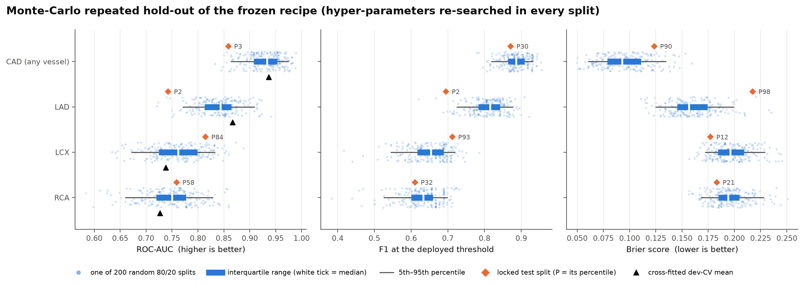
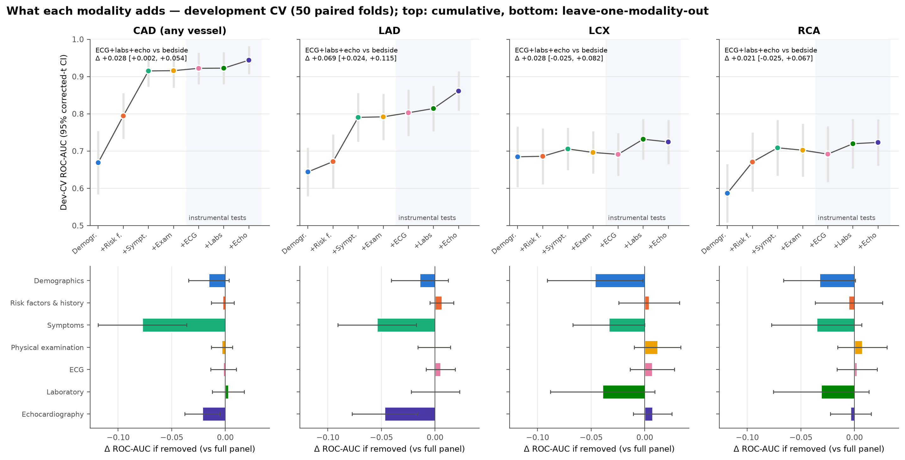
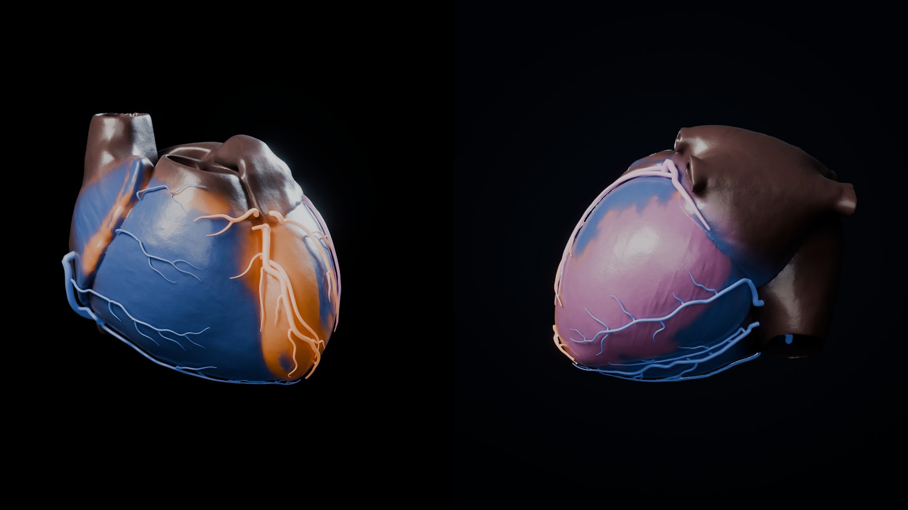
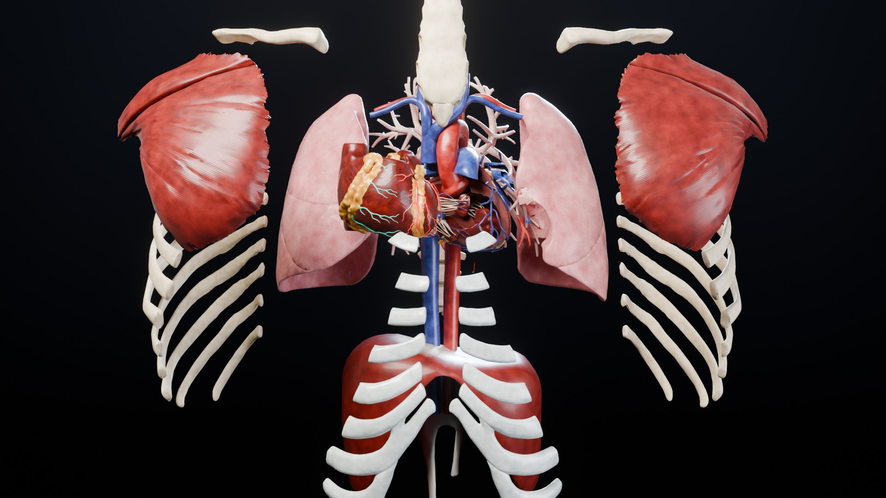
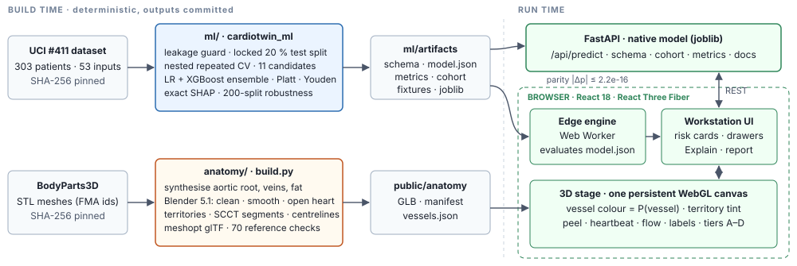

# CardioTwin: explainable coronary-risk prediction on an interactive 3D heart

Technical report · Multimodal AI Hackathon 2026, Track A (Cardiovascular Risk Visualization &amp; Prediction) ·
Mohammad Umar · model v1.1.0 · <a href="https://github.com/Mohammad-Umar7/CardioTwin">github.com/Mohammad-Umar7/CardioTwin</a>

> **Clinical safety.** CardioTwin is a research and educational decision-support prototype. Its outputs are not a
> diagnosis and not a substitute for coronary angiography, CT coronary angiography or clinical judgement. Risk is
> estimated per vessel, never localised within a vessel.

## 1 Problem and approach

Patients referred for invasive coronary angiography already have a history, an examination, an ECG, labs and an echo.
Risk scores condense these into one whole-heart number. They say neither *which* artery is at stake nor *why*.
CardioTwin estimates the probability of overall **CAD** (≥ 1 major artery with ≥ 50 % stenosis) and of stenosis in
the **LAD, LCX and RCA**. It explains every estimate with exact SHAP values and paints each probability onto the
matching artery of an interactive 3D heart built from open anatomy. The contributions are:

1. **Leakage-safe, honestly validated models.** The test split is locked before any modelling. Tuning is nested and
   the ensemble CV estimate is cross-fitted. Every test metric carries a bootstrap CI, and a 200-split Monte-Carlo
   analysis shows how representative the single test split is.
2. **Exact, portable explanations.** One JSON model is evaluated identically by the Python server and a TypeScript
   engine in the browser (|Δp| ≤ 2.2e-16, identical SHAP), so a static deployment needs no backend.
3. **An anatomically validated 3D pipeline.** BodyParts3D is processed by Blender into a 41-structure glTF with
   perfusion territories, SCCT 2014 coronary segments and flow centrelines. The asset is graded against 70 cited
   anatomical criteria.

## 2 Data and preprocessing

**Dataset.** *Extension of Z-Alizadeh Sani* (UCI #411, DOI 10.24432/C5461K, CC BY 4.0) contains 303 consecutive adults
referred for angiography at one centre in Tehran. It has 55 candidate inputs, no missing values, and angiographic
labels. Prevalence is **CAD 71.3 %, LAD 58.4 %, LCX 39.3 %, RCA 37.6 %**. The spreadsheet is committed and verified by
SHA-256 on every run.

**Preprocessing.** `Y/N` and `0/1` are unified, `Fmale` is mapped to `Female`, `BBB` is one-hot encoded and `VHD` is
ordinal. Columns constant in the development set are dropped (`Exertional CP`, and `CHF`, whose only positive
patient is in the test set). That leaves **53 inputs in 7 modality groups**: demographics 5, risk factors and history
11, symptoms 6, examination 7, ECG 7, laboratory 14, echocardiography 3. Imputation and scaling are fitted inside
each training fold. A registry (`features.yaml`) holds each feature's unit, range, reference range and description.

**Leakage policy.**

- *Outcomes are never inputs.* `LAD, LCX, RCA, Cath` are blocked by the training leakage guard, a unit test, a
  422 `leakage_feature` from the API, and the browser's input sanitiser.
- *The test split is locked first.* It holds 20 % (61 patients), seed 42, stratified on the joint CAD/LAD/LCX/RCA
  label pattern. The remaining 242 patients are used for everything else.
- *Post-hoc steps see only out-of-fold data.* Ensemble weights, calibration and thresholds are fitted on out-of-fold
  predictions only.
- *The test set is scored once per release* (twice in total). v1.1.0 fixed a calibration defect that an independent
  code review found, and every change was specified on the development set only. See
  [`MODEL_CARD.md`](MODEL_CARD.md) §11.

## 3 Models

**Candidates.** Eleven model families were compared on identical folds of a repeated stratified 5-fold × 10 CV
(nested tuning: an inner 5-fold `RandomizedSearchCV` on **log-loss**):

- logistic regression: L2, L1, elastic net, and a "clinical core" variant on age, sex, typical angina, DM and HTN;
- SVM (RBF), k-nearest neighbours and XGBoost (all tuned);
- random forest, extra trees and histogram gradient boosting (fixed settings);
- a prior-only dummy.

Three evidence-driven extras were tested on paired folds and **all rejected** against a +0.005 ROC-AUC adoption bar:
derived features (NLR, TG/HDL, CKD-EPI eGFR) +0.0015, in-fold feature selection −0.0065, and a classifier chain
+0.0015.

**Deployed ensemble** (one per target). The margin is `m = w·m_LR + (1−w)·m_XGB` and the probability is
`p = σ(a·m + b)` (Platt scaling). The label uses Youden's-J threshold. The logistic variant is chosen by nested-CV
ROC-AUC. `w`, `a, b` and the threshold are fitted on 10 × 5 out-of-fold margins of components that use exactly the
deployed hyper-parameters, so the calibration map matches the deployed margin scale. The CV row reported for the
ensemble is **cross-fitted**: every choice is re-made without the scored fold.

| Target | Logistic component | w (LR) | XGBoost | Platt a, b | Threshold | Top features (mean \|SHAP\|) |
| --- | --- | --- | --- | --- | --- | --- |
| CAD | elastic net, C 0.318 | 0.40 | 108 trees, depth 2 | 1.284, −0.207 | 0.747 | typical angina, age, RWMA |
| LAD | L1, C 0.133 | 0.55 | 290 trees, depth 3 | 1.278, 0.080 | 0.551 | typical angina, RWMA, age |
| LCX | L2 on clinical core, C 0.248 | 0.60 | 120 trees, depth 2 | 1.063, 0.048 | 0.327 | typical angina, age, sex |
| RCA | L2 on clinical core, C 0.248 | 0.70 | 120 trees, depth 2 | 1.026, 0.026 | 0.318 | typical angina, DM, sex |

## 4 Evaluation

**Locked test set** (n = 61, never seen during development). Values are point estimates at the deployed threshold,
with 95 % stratified-bootstrap CIs (2000 resamples) below them. The last column is the development CV
(mean ± sd over 50 folds).

| Target | ROC-AUC | PR-AUC | Accuracy | Precision | Recall | Specificity | F1 | Brier | Dev-CV ROC-AUC |
| --- | --- | --- | --- | --- | --- | --- | --- | --- | --- |
| **CAD** | **0.858** 0.743–0.955 | 0.937 0.884–0.983 | 0.820 0.721–0.918 | 0.902 0.829–0.975 | 0.841 0.727–0.932 | 0.765 0.588–0.941 | **0.871** 0.791–0.940 | 0.123 0.068–0.182 | 0.937 ± 0.034 |
| **LAD** | 0.742 0.612–0.858 | 0.824 0.738–0.901 | 0.639 0.525–0.754 | 0.694 0.594–0.808 | 0.694 0.556–0.833 | 0.560 0.360–0.760 | 0.694 0.580–0.800 | 0.217 0.150–0.288 | 0.867 ± 0.057 |
| **LCX** | 0.814 0.701–0.907 | 0.761 0.634–0.888 | 0.721 0.607–0.820 | 0.618 0.513–0.735 | 0.840 0.680–0.960 | 0.639 0.472–0.778 | 0.712 0.600–0.808 | 0.177 0.142–0.215 | 0.738 ± 0.053 |
| **RCA** | 0.759 0.627–0.866 | 0.702 0.560–0.833 | 0.623 0.508–0.738 | 0.500 0.405–0.606 | 0.783 0.609–0.913 | 0.526 0.368–0.684 | 0.610 0.491–0.714 | 0.183 0.150–0.221 | 0.727 ± 0.071 |

On the 12-entry CV leaderboard the ensemble ranks first for LAD and LCX and second for CAD and RCA. Every gap among
the top entries is far smaller than the fold-to-fold sd.

**Calibration and clinical utility.** Mean risk is well calibrated on the test set: calibration-in-the-large is
−0.016, −0.001, +0.018 and +0.003, with ECE 0.079, 0.133, 0.116 and 0.055 (CAD, LAD, LCX, RCA). The test
calibration slopes (0.62, 0.47, 1.47, 1.30) show over-confidence for CAD and LAD *on this split*. Across 200 splits
the median slope is 0.97–1.04 for every target. In decision-curve analysis the model's net benefit exceeds both
treat-all and treat-none at every deployed threshold (`figures/decision_curves.png`).

**Robustness: is the locked split representative?** The complete recipe (hyper-parameter search, out-of-fold
`w` / Platt / threshold, refit) was re-run on **200 random stratified 80/20 splits** and scored once per split. The
harness reproduces the deployed model on the locked split exactly (max |Δp| = 0).

| Target | Locked test ROC-AUC | Monte-Carlo median (5th–95th pct) | Locked split's percentile | Dev-CV (its percentile) | Beats 5-feature baseline | Locked test Δ vs baseline (95 % CI) |
| --- | --- | --- | --- | --- | --- | --- |
| CAD | 0.858 | **0.934** (0.864–0.975) | **3rd** | 0.937 (52nd) | 84 % of splits | +0.037 (−0.023 to +0.100) |
| LAD | 0.742 | **0.844** (0.771–0.909) | **2nd** | 0.867 (78th) | 92 % of splits | −0.001 (−0.082 to +0.087) |
| LCX | 0.814 | 0.762 (0.672–0.833) | 84th | 0.738 (33rd) | 76 % of splits | +0.009 (−0.043 to +0.057) |
| RCA | 0.759 | 0.751 (0.660–0.828) | 58th | 0.727 (30th) | 69 % of splits | +0.015 (−0.023 to +0.054) |

The locked split is among the hardest 3 % for CAD and LAD, and the clinical baseline also lands at its 4th and
14.5th percentile there. The cross-fitted CV means sit mid-distribution. **The CV-to-test gap is therefore split
difficulty, not overfitting.** The Monte-Carlo medians describe the expected held-out performance better than the
single split does. Re-searching hyper-parameters in every split instead of reusing the deployed ones changes the mean
ROC-AUC by ≤ 0.0007, so there is no tuning optimism. Caveat: test parts overlap across splits, and all come from one
centre.

<figure><figcaption>Figure 1. Held-out ROC-AUC, F1 and Brier over 200 random splits. The diamond marks the locked test split and its percentile, and the triangle the cross-fitted CV mean.</figcaption></figure>

**Modality ablation** (development CV, 50 paired folds, fixed model, Nadeau–Bengio corrected-t CIs, Holm-adjusted).
Adding **ECG, labs and echo** to bedside information (demographics, history, symptoms, examination) raises ROC-AUC by
**+0.028 (+0.002 to +0.054) for CAD** and **+0.069 (+0.024 to +0.115) for LAD**. For LCX and RCA the gains are
+0.028 and +0.021, and both CIs include 0. Removing symptoms costs the most (CAD −0.077, LAD −0.054). Echo is the only
instrumental modality with unique information for CAD and LAD (−0.021 and −0.047), and the ECG adds nothing once
echo and labs are present (|Δ| ≤ 0.007).

<figure><figcaption>Figure 2. What each modality adds (development CV, 50 paired folds, 95 % corrected-t CIs). Top: cumulative ROC-AUC from demographics to the full panel, with the instrumental tests shaded. Bottom: ROC-AUC lost when one modality is removed.</figcaption></figure>

**Subgroups** (exploratory, OOF). CAD discrimination is similar across sex, age band and diabetes (0.90–0.98).
Vessel-level discrimination is lower for LCX over 65 (0.54 vs 0.75, Δ −0.21, CI −0.36 to −0.05) and for LAD with
diabetes (0.75 vs 0.88). Calibration-in-the-large stays within ±0.09 in every subgroup.

**Honest limitations of the evidence.** On the locked test set the full panel does **not** significantly beat the
pre-specified 5-feature clinical baseline for any target (every paired CI includes 0). Vessel-level discrimination
for LCX and RCA is modest (Monte-Carlo medians 0.76 and 0.75). With 61 test patients the CIs are wide.

## 5 Explainability

The SHAP values are **exact** and live in the ensemble's log-odds space:

- **Logistic component:** linear SHAP against the development mean, `φ_j = β_j/σ_j · (x_j − x̄_j)`.
- **XGBoost component:** path-dependent TreeSHAP (Lundberg 2018, Alg. 2), re-implemented in **float64**. XGBoost's
  own float32 `pred_contribs` misses a 1e-6 additivity contract.
- **Ensemble:** `φ = w·φ_LR + (1−w)·φ_XGB`, so `base + Σφ = m`. The observed additivity error is ≤ 1.8e-15.
  Agreement with `pred_contribs` and with the `shap` 0.51 library is ≤ 3.9e-7 (their float32 precision).
- **Calibrated space:** every response also carries `shap_calibrated = a·φ`, which adds up exactly to `σ⁻¹(p)`.

The UI shows contributions in **percentage points** by default, `pts_i = φ_i · (p − p₀)/(m − m₀)`. These add up
exactly from a typical patient's probability `p₀` to this patient's `p`, and exact log-odds are one toggle away.

The Explain drawer has four tabs:

| Tab | Shows |
| --- | --- |
| **Why** | A one-sentence takeaway, a signed waterfall of the top drivers that raise or lower risk, and a modality strip (SHAP summed per group) |
| **Physiology** | Every measurement with its value, reference range and in/out-of-range status next to its contribution, filtered to abnormal values by default |
| **What-if** | Recorded vs edited probability for all four targets, and the levers that would move the risk most |
| **Model** | The deployed components and threshold, test performance with CIs, what each modality adds, calibration, and the provenance of this estimate |

When a numeric input is expanded, an ICE strip shows how the risk responds across that input's range. Explanations describe
associations in the model, not causes.

## 6 3D anatomy pipeline

`anatomy/build.py` is a scripted, reproducible pipeline driven by one declarative config (`anatomy.json`). A rebuild
leaves the committed assets unchanged.

1. **Fetch.** BodyParts3D STL meshes (FMA-named) are downloaded and pinned by SHA-256.
2. **Synthesise.** What BodyParts3D lacks or has collapsed is built deterministically: an aortic root with three
   sinuses and a valve, in-vivo cardiac-vein calibres re-seated outside the epicardium, and epicardial fat in the
   grooves.
3. **Blender 5.1, headless.** Parts are cleaned (inward pockets and fragments removed), cropped to the thorax,
   Taubin-smoothed to remove ~1 mm segmentation terraces, and decimated to per-node budgets (the coronaries are never
   decimated). The heart is bisected along its long axis and capped so it can be opened.
4. **Territories.** Heart-wall vertices carry `COLOR_0 = (w_LAD, w_LCX, w_RCA)`: a nearest-artery softmax
   (σ = 7 mm) masked to ventricular myocardium and blended 85 % towards the AHA 17-segment standard map. The septum
   is split by the septal perforators. This is a supply map, not a lesion map.
5. **Centrelines and segments.** Each coronary is voxelised at 0.25 mm, skeletonised, reduced to a minimum spanning
   tree, pruned, rooted at its ostium, spline-smoothed and resampled every 0.8 mm with the lumen radius. Branches are
   labelled with **SCCT 2014 segments** (18 in the manifest, baked per vertex as `_SEGMENT`) and arc length
   (`_ARCLEN`, which drives the flow particles). Of 2,612 centreline points, 99.85 % lie inside their vessel
   (max 0.31 mm outside).
6. **Web optimisation and contracts.** meshopt compression and WebP PBR textures (≤ 16 MB budget; the current GLB is
   8.4 MB) bring the asset to 41 named structures in 7 layers and ≈ 400k triangles. Node names and transforms are
   verified. A triangle-level check guarantees that the exploded layout creates no new collisions, and the manifest
   maps each model target to its nodes.

**Anatomical validation.** `docs/anatomy/REFERENCE.md` compiles the target anatomy from cited sources (SCCT 2014,
AHA 2002, ASE/EACVI 2015, Radiopaedia and others). `reference_checks.yaml` turns it into 70 graded criteria covering
position, chambers, valves, great vessels, coronaries, veins and colour conventions, and `measure_model.py`
measures the published GLB against them.

| Snapshot | PASS | MINOR | FAIL |
| --- | --- | --- | --- |
| Baseline, before the realism work (`anatomy/checks/gap_report.md`) | 35 | 12 | 23 |
| Current asset: the 41-structure realism rebuild (re-run for this report, 30 Sep 2026) | **44** | 7 | 19 |

Passes include:

- heart position, axis, size and cardiothoracic ratio;
- valve order and great-vessel courses;
- the left main and the LAD course;
- the AHA segments specific to the LAD;
- SCCT labelling.

The main open items are:

- a LCX trunk that leaves the AV groove;
- the course of the proximal RCA;
- valve-annulus levels and aorto-mitral continuity;
- a short SVC;
- the LV share of the territory map (LAD 38 %, RCA 38 % vs a reference of about 43 % and 26 %);
- small mesh interpenetrations with the lungs and diaphragm.

<figure class="pair"><figcaption>Figure 3. Cycles renders of the published asset. Left: perfusion territories tinted by an example risk profile (LAD very high, LCX moderate, RCA low), in anterior and posterior-inferior views. Right: the radial exploded layout used by the viewer's dissection.</figcaption></figure>

## 7 System and usage

<!-- SCREENSHOT: workstation → docs/media/screenshots/workstation.png (optional in this report; re-run the PDF build and keep it ≤ 6 pages) -->
<figure><figcaption>Figure 4. Architecture. Two deterministic build pipelines produce committed artifacts, which the FastAPI server and the browser consume through versioned contracts (<code>docs/CONTRACTS.md</code>).</figcaption></figure>

**Engines.** The UI talks to a single `PredictionEngine` interface. The *server engine* calls `POST /api/predict`
(FastAPI with the native joblib models, schema-driven validation, an LRU cache, and ETags). The *edge engine* is a
Web Worker that evaluates `model.json` with a line-by-line TypeScript port of the reference evaluator, down to
float32 split comparisons and the float64 operation order. The app picks the server when `/api/health` answers within
1.5 s, fails over to the edge engine on errors, and labels every response with its engine.

Parity with the server is measured, not assumed:

- 39 fixtures, 81 cohort patients and 3,800+ live responses give max |Δp| 2.2e-16 and |Δshap| = 0;
- all 4,130 probes at the 444 XGBoost split thresholds route correctly.

Latency is p50 ≈ 24 ms per new patient over HTTP and p50 1.2 ms in the browser worker. The 3D stage runs without a
dedicated GPU: it uses one persistent canvas, an on-demand frame loop, adaptive tiers A→C by measured frame rate,
and a 2D SVG fallback.

**Workflow.**

1. **Landing.** A live KPI strip and a guided tour.
2. **Workstation.** Choose one of 81 demo patients (61 unseen test patients with their angiogram result, plus 20
   development patients). The risk summary card shows the CAD verdict and flagged vessels, and each artery glows in
   its probability's colour.
3. **Select a vessel.** Use a click, `1/2/3` or the palette. The camera flies to an occlusion-aware angiographic best
   view (LAD RAO 30 / CRA 25) and the inspector explains that vessel.
4. **Explore the anatomy.** C-arm presets, the peel and dissection slider, a heartbeat paced by the patient's pulse,
   blood-flow particles, territory tints and SCCT labels on hover.
5. **Edit inputs.** Every estimate, SHAP bar and colour updates live, after a 150 ms debounce.
6. **Performance page.** CIs, calibration, decision curves, robustness and subgroups.
7. **Printable report.** A two-page clinical report.

**How to run.** Prerequisites are Python 3.11 and Node 22, plus Blender 5.1 only to rebuild the anatomy.

| Command | Does |
| --- | --- |
| `.\scripts\dev.ps1 setup` then `serve` (Windows) | Creates the environment, then serves app and API on one URL: `http://localhost:8000` |
| `make setup && make serve` (POSIX) | The same on Linux or macOS |
| `docker compose up --build` | The same in a container |
| `python -m cardiotwin_ml.train` | Retrains (~4 min) |
| `python -m cardiotwin_ml.analysis` | Re-runs robustness, modality and subgroups |
| `python anatomy/build.py` | Rebuilds the anatomy |

CI runs the ML, anatomy, API and frontend test suites, a byte-identical retraining check, and an end-to-end check
of the API serving the built app. It also boots the Docker image and runs a one-command start from a clean checkout
on Windows and Linux.

## 8 Limitations, safety and future work

**Limitations.**

- The data are small, from one centre and a referred population (71 % CAD prevalence). Probabilities do not transfer
  to screening populations without recalibration.
- The labels are visual ≥ 50 % stenosis: anatomical and operator-dependent, not ischaemia. One patient has
  inconsistent labels, which are used as published.
- The full panel adds little over a 5-feature baseline for LCX and RCA.
- The 3D territories are an approximation and the model never localises lesions. Some anatomical checks still fail
  (§6).

**Safety by design.**

- A disclaimer is on every page, in the API's health response and on every printed page.
- Uncertainty is shown next to every number, and explanations are worded as associations.
- The UI shows "Estimate unavailable" rather than invented numbers.
- Out-of-range inputs are rejected instead of extrapolated.
- No patient data leave the browser in edge mode, and the server is stateless.

**Future work.**

- External, multi-centre validation with local recalibration.
- Thresholds chosen for the clinical costs of each setting.
- Imaging inputs (CT coronary angiography or perfusion) for lesion-level targets.
- Closing the remaining anatomical checks: the LCX course, the aortic root to the annulus, and the territory shares.

<b>References.</b> Alizadehsani R. et al., Extension of Z-Alizadeh Sani dataset, UCI ML Repository, doi:10.24432/C5461K ·
Lundberg S.M. et al., Consistent individualized feature attribution for tree ensembles, 2018 · Nadeau C., Bengio Y., Inference for the
generalization error, Machine Learning 2003 · Leipsic J. et al., SCCT guidelines for coronary CTA, JCCT 2014 · Cerqueira M.D. et al.,
Standardized myocardial segmentation, Circulation 2002 · BodyParts3D, © The Database Center for Life Science, CC BY-SA 2.1 JP ·
Mitchell M. et al., Model Cards for Model Reporting, FAT* 2019. Every number in this report is traceable to
<code>ml/artifacts/metrics.json</code>, <code>ml/reports/results.md</code>, <code>docs/MODEL_CARD.md</code>,
<code>frontend/src/inference/README.md</code> or <code>anatomy/checks/measure_model.py</code>.

